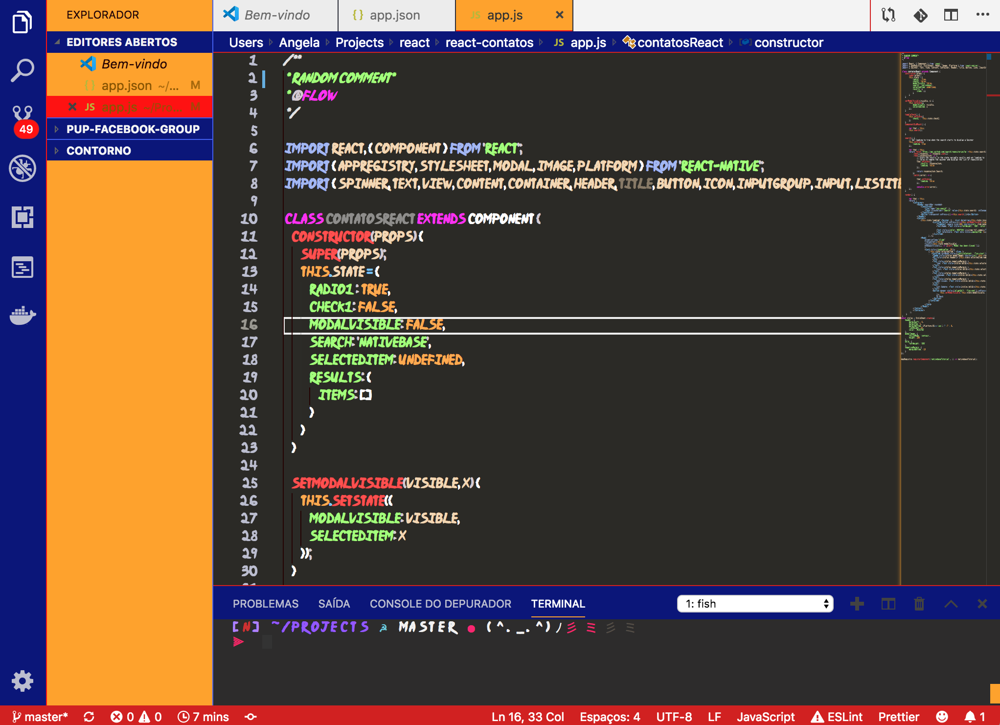

# 🍥 Naruto VSCode Theme 🍥


> ✬ The ninja way of using VSCode

## 1. Install font

Install the [Ninja Naruto](https://www.dafont.com/ninja-naruto.font) font


Add this line to your workspace settings json.
- on Windows `%APPDATA%\Code\User\settings.json`
- on Mac `$HOME/Library/Application Support/Code/User/settings.json`
- on Linux `$HOME/.config/Code/User/settings.json`
```json
{
 "editor.fontFamily": "'Ninja Naruto'",
}
```

## 2. Install Theme
Clone the project in the vscode extension directory. This is:
- on Windows `%USERPROFILE%\.vscode\extensions`
- on Mac/Linux `$HOME/.vscode/extensions`

```bash
git clone https://github.com/anabastos/naruto-theme.git
```

# 3. Dattebayo! 👍
Restart VSCode and select the new theme in File -> Preferences -> Color Theme
